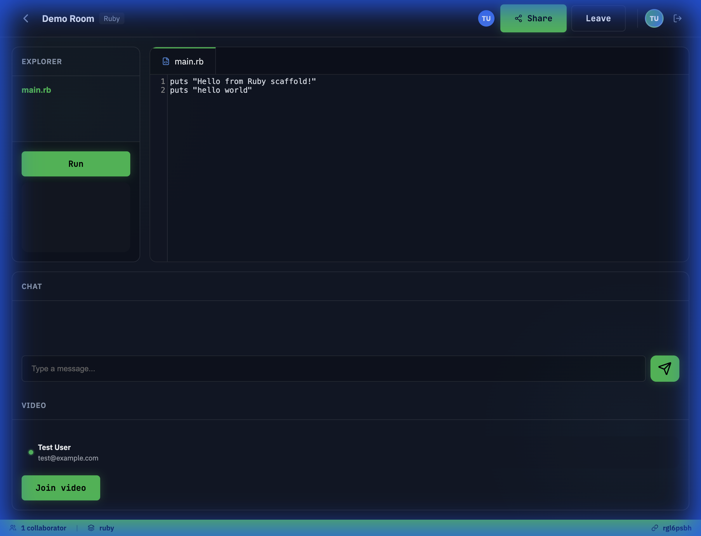
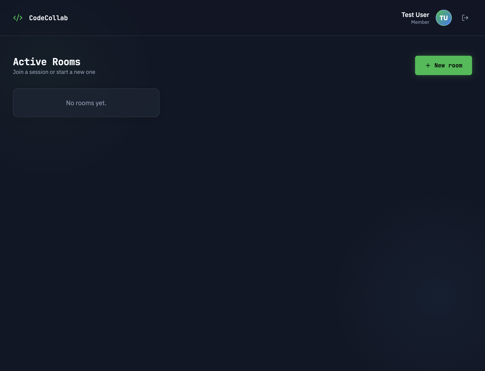
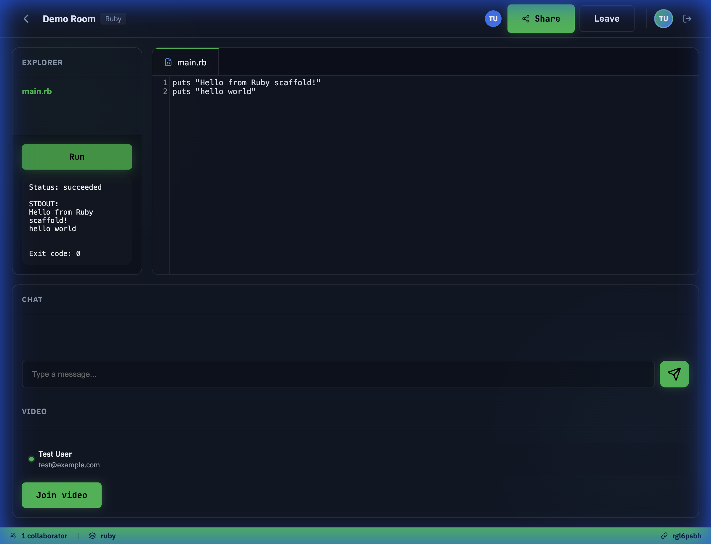

[!NOTE]
> Este proyecto fue completado mediante **Vibe Coding**

---

# code-collab

Un editor de código colaborativo en tiempo real y de alto rendimiento para programación en pareja, entrevistas y equipos remotos. Construido sobre el stack moderno de Rails 8.



## Funcionalidades

- **Colaboración en tiempo real** — Transformación Operacional distribuida (OT) para edición concurrente sin conflictos.
- **Explorador de archivos integrado** — Navega y gestiona las estructuras de proyecto dentro del espacio de trabajo virtual.
- **Ejecución de código instantánea** — Ejecuta scripts de Ruby directamente en el navegador y visualiza la salida en tiempo real.
- **Video y chat con WebRTC** — Comunicación fluida con transmisión de video y mensajería instantánea integradas.
- **Espacios de trabajo seguros** — Salas protegidas con contraseña y aislamiento seguro de usuarios.
- **UI/UX premium** — Un diseño con prioridad para el modo oscuro y estilo glassmórfico, creado para desarrolladores.

## Galería

<p align="center">
  
  
</p>

## Stack Tecnológico

| Capa | Tecnología |
|-------|-----------|
| Framework | Rails 8.1 (Ruby 3.4) |
| Frontend | Hotwire (Turbo & Stimulus), Vanilla CSS, Lucide Icons |
| Tiempo real | ActionCable (WebSockets), Redis para el estado de la sesión OT |
| Comunicación | WebRTC para video/audio peer-to-peer |
| Despliegue | Docker, Kamal, Thruster |

## Comenzando

### Prerequisitos

- Ruby 3.4.x
- Redis
- SQLite3
- Docker (requerido para los entornos de ejecución de código)

### Instalación

1. **Clona el repositorio**

   ```bash
   git clone https://github.com/your-org/code-collab.git
   cd code-collab
   ```

2. **Instala las dependencias**

   ```bash
   bundle install
   ```

3. **Configura la base de datos**

   ```bash
   bin/rails db:prepare
   ```

4. **Descarga las imágenes de Docker requeridas**

   ```bash
   docker pull node:20-alpine
   docker pull python:3.12-alpine
   docker pull ruby:3.3-alpine
   ```

5. **Inicia la aplicación**

   ```bash
   bin/dev
   ```

   Visita `http://localhost:3000`.

## Desarrollo

```bash
# Ejecuta las pruebas
bin/rails test

# Linting
bin/rubocop

# Análisis de seguridad
bin/brakeman
```

## Contribuir

1. Haz un fork del repositorio
2. Crea tu rama de características (`git checkout -b feature/my-feature`)
3. Realiza commits de tus cambios siguiendo [Conventional Commits](https://www.conventionalcommits.org/)
4. Sube la rama (`git push origin feature/my-feature`)
5. Abre una Pull Request

Asegúrate de que `bin/ci` pase antes de solicitar una revisión.

## Licencia

Este proyecto está disponible bajo la [Licencia MIT](LICENSE).
