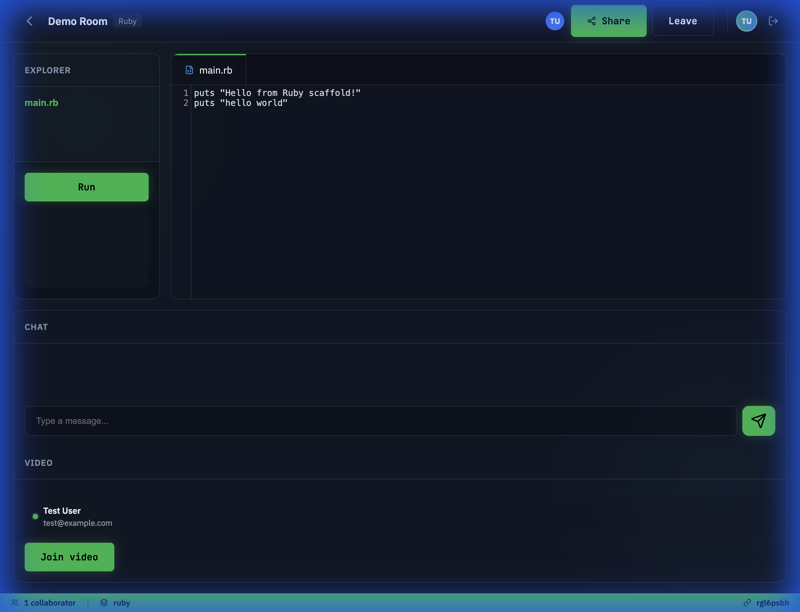
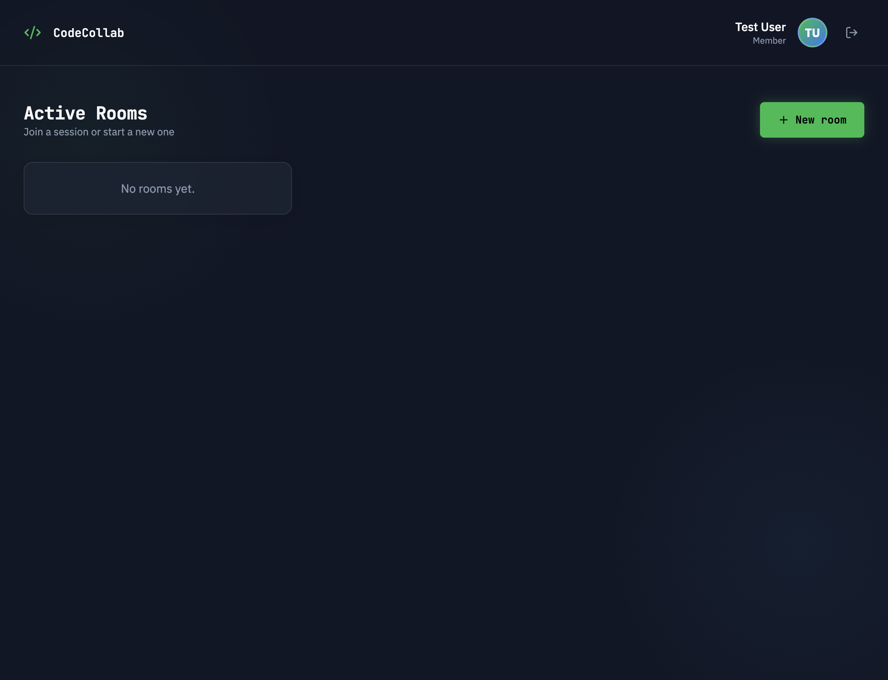
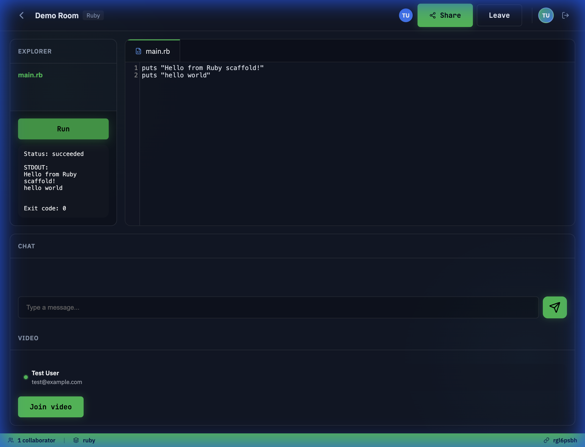

# 🚀 code-collab

> **Vibe Coded with AI** 🤖✨
> This entire platform was built using "AI Vibe Coding" principles—prioritizing flow, creativity, and rapid iteration with AI pair programming.

code-collab is a high-performance, real-time collaborative code editor designed for pair programming, interviews, and remote teams. Built on the modern Rails 8 stack with a focus on speed, reliability, and rich user experience.



## 🌟 Key Features

- **⚡ Real-Time Collaboration**: Distributed Operational Transformation (OT) for conflict-free concurrent editing.
- **📁 Integrated File Explorer**: Browse and manage project structures within the virtual workspace.
- **▶️ On-the-Fly Code Execution**: Run Ruby scripts directly in the browser and see real-time output.
- **🎥 WebRTC Video & Chat**: Seamless communication with built-in video streaming and instant messaging.
- **🔐 Secure Workspaces**: Password-protected rooms and secure user isolation.
- **🎨 Premium UI/UX**: A dark-mode first, glassmorphic design built for developers.

## 📸 Gallery

<p align="center">
  
  
</p>

## 🛠️ Tech Stack

- **Framework**: Rails 8.1 (Ruby 3.4)
- **Frontend**: Hotwire (Turbo & Stimulus), Vanilla CSS, Lucide Icons
- **Real-time**: ActionCable (WebSockets), Redis for OT session state
- **Communication**: WebRTC for Peer-to-Peer Video/Audio
- **Deployment**: Docker, Kamal, Thruster

## 🚀 Getting Started

### Prerequisites

- Ruby 3.4.x
- Redis
- SQLite3
- Docker (required for running the code execution environments)

### Installation

1. **Clone the repository**
   ```bash
   git clone https://github.com/your-org/code-collab.git
   cd code-collab
   ```

2. **Install dependencies**
   ```bash
   bundle install
   ```

3. **Setup Database**
   ```bash
   bin/rails db:prepare
   ```

4. **Pull required Docker images**
   ```bash
   docker pull node:20-alpine
   docker pull python:3.12-alpine
   docker pull ruby:3.3-alpine
   ```

5. **Start the environment**
   ```bash
   bin/ot_dev
   ```
   This script starts both the web server and the OT workers. Visit `http://localhost:3000` to start vibe coding!

## 🧪 Development & Testing

```bash
# Run tests
bin/rails test

# Linting
bundle exec rubocop
```

## 🧠 AI Vibe Coding Philosophy

This project isn't just "AI-assisted"; it's **AI-driven**. 
- **Rapid Prototyping**: Complex OT logic implemented through iterative AI dialogue.
- **Design Consistency**: CSS design tokens and layout systems generated for maximum aesthetic "wow" factor.
- **Minimal Overhead**: Focusing on the "vibe" and functionality, letting AI handle the boilerplate.

---
Built with ❤️ and 🤖 by the AI Vibe Coding movement.
